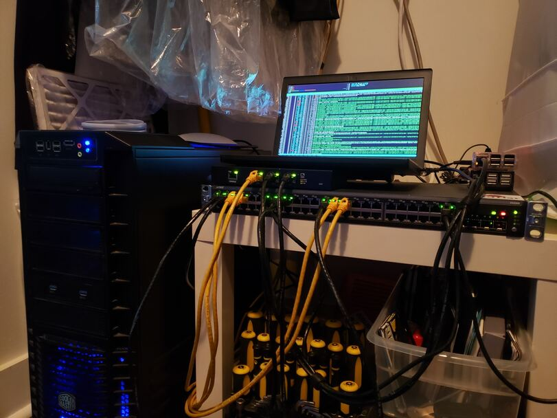
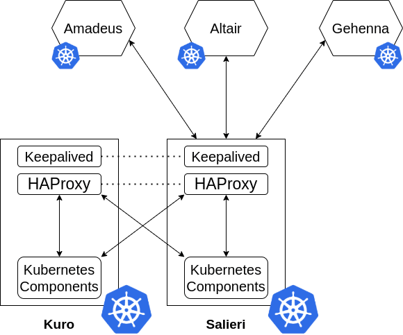

CHAD is a self-hosted compute cluster capable of running distributed workloads and services with Kubernetes.
The project originally grew from the single dedicated web server I hosted in my closet.

Over 5 years ago, I started using Linux and hosting public-facing services from my desktop; mainly, game servers for me and my friends.
A couple years later, I repurposed an old desktop as a dedicated machine for my services.
Having a dedicated machine greatly increased reliability, took load off my desktop, and was very easy to manage.
This worked out well until the machine started to idle at ~70% memory usage, which meant that adding more services wouldn't be feasible.
Likewise, all of my services were in danger of going down if the memory spiked and ran out during intensive loads.

To fix this problem, I decided to use some of the machines I had lying around and build them into a horizontally scaling cluster.
Following this approach would allow for my services to scale while also remaining budget friendly.

## Hardware

### Main Nodes

Low-power and low performance. Responsible for the high-availability Kubernetes control plane.

* Salieri - Thinkpad X250
  - i5 5300u 2c/4t
  - 8gb ram
* Kuro - ODROID-C2
  - Cortex-A53 4c/4t
  - 2gb ram

Originally, I also had a Raspberry Pi 3 as an infrastructure node, but I removed it due to out-of-memory crashes.

### Compute Nodes

High-frequency with fast single core speeds. Runs production services.

* Amadeus - Dedicated Server
  - Overclocked i5 3570k 4c/4t
  - 16gb ram
* Altair - Main Workstation
  - Ryzen 3900x 12c/24t
  - 32gb ram
* Gehenna - Home Theater PC
  - Overclocked i7 4770k 4c/8t
  - 16gb ram

This works out to a total of 20 cores, 36 threads, and 64GB of memory for compute resources, which is a huge improvement from the single dedicated machine.

## Design

To put it simply, CHAD is stacked.
I say stacked because high-availability load balancing is performed on the infrastructure nodes themselves (inside kubernetes).
This design avoids the need to mess with dedicated load balancers and keeps everything simple to setup.
In the event that Salieri goes down, Kuro functions as a simple backup.
Otherwise, control plane requests are split evenly between Kuro and Salieri.

## Networking

For security purposes, I won't describe any specific network configurations.
However, here is a list of the hardware I use for the cluster:

* Ubiquiti EdgeRouter Lite
* Juniper Networks EX2200-48P-4G

Overall, everything runs on wired gigabit connections.
This works fine and isn't prohibitively expensive compared to 10GbE.
Latency is <1ms between all nodes.

## Services

CHAD runs a multitude of Open Source software and game servers, both publicly and privately.
All of these deployments are managed under the GitOps methodology.

Here are some of the services currently running:

* Metallb - Bare metal load balancing for Kubernetes
* Traefik - Kubernetes Ingress controller
* Jellyfin - Media streaming
* Minecraft - Public PaperMC server
* Syncthing - P2P distributed file synchronization

## Principles & Methodologies

### GitOps

In order to manage all of the services effectively, all deployments are stored declaratively in git.
This workflow makes it very easy to keep track changes and have them continuously deployed (or rolled back) with a tool like Argo CD.

### Chaos Engineering

Currently, chaos engineering for the cluster occurs at the platform level.
Nodes are regularly taken offline, and pods must migrate between nodes.
In my opinion, it's important to routinely test resilience; most systems are not 100% reliable.

## Persistence

All persistent storage for the cluster is handled by two tiers of NFS storage on the Amadeus node.
The first tier is high-performance, solid-state storage and the second tier is bulk data storage.
I find that providing multiple tiers of storage allows for optimization on a per-application basis.

Ultimately, these storage services are abstracted as persistent volumes within Kubernetes.
As a result, storage can be modified without making changes to individual applications.
This approach will be useful when migrating to a more robust storage service, such as Ceph or GlusterFS.

## Conclusion

Overall, this project accomplished a lot of what I needed, while also being incredibly overkill at the same time.
After several months of running this, service reliability now hovers around 99.7% (~2 hours down a month), which is mainly due to power and internet outages each month.
